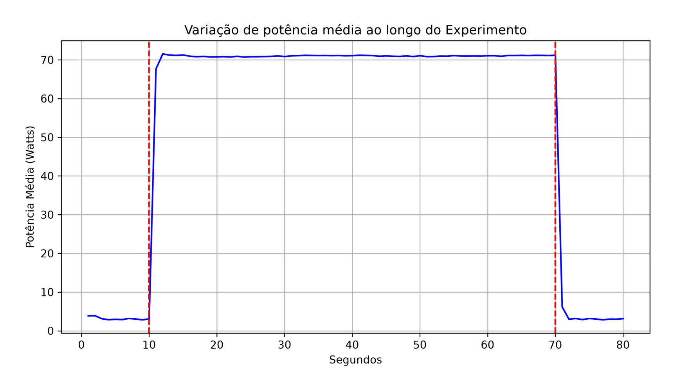

No passo anterior, utilizamos um script para monitorar os contadores de energia do processador e o timestamp da medição. No entanto, para visualizarmos o comportamento da aplicação executada é necessário tratar os dados coletados. 

Nessa etapa, vamos automatizar o cálculo da **Potência Média (em Watts)** entre as medições realizadas e, em seguida, utilizaremos as bibliotecas `numpy` e `matplotlib` para gerarmos uma visualização gráfica do consumo de energia monitorado.
# Potência Média
A física nos diz que a Potência é a variação de energia dividida pela variação do tempo:
$$P = \frac{\Delta E}{\Delta t}$$

Logo, suponha que as duas medições abaixo foram extraídos do arquivo gerado na etapa anterior, sendo a primeira coluna referente a energia acumulada em microjoules e a segunda coluna o contador de tempo (timestamp) em segundos.
```
99981016814 1646987.469997645 
100036646188 1646988.470136542 
```
Com uma subtração básica, descobrimos a variação de tempo e energia:
$$\Delta E = 100036646188 - 99981016814 = 55629374$$
Convertendo para joules:
$$\Delta E = 55629374 \times 10^-6 \approx 55,6 \text{ joules} $$

$$\Delta t = 1646988.470136542 - 1646987.469997645 \approx 1 \text{ segundo} $$

Assim, a Potência Média será de **55,6 Watts**.
# Script para Conversão de Dados e Cálculo de Potência Média
Para automatizar essa tarefa, a função abaixo recebe o arquivo com os dados brutos e calcula a potência média entre todas as medições.
```python
leitura = []
with open(args.arquivoIn, "r") as inputFile:
    linhas = inputFile.readlines()
    linhaAnterior = linhas[0].split()
    tempoMedicao = 0
    tempo = []

    for i in range(1, len(linhas)):
        linha = linhas[i].split()
        
        deltaTempo = float(linha[1]) - float(linhaAnterior[1])

        deltaWatts = (float(linha[0]) - float(linhaAnterior[0])) * (10**-6)/deltaTempo

        #populando matriz para criar graficos depois
        leitura.append([deltaWatts, deltaTempo])
        arquivoOut.write(f"{deltaWatts} {deltaTempo}\n")
        tempoMedicao += deltaTempo
        tempo.append(tempoMedicao)


        linhaAnterior = linha
``` 

 Note que o loop da iteração for funciona da seguinte forma:
```
[ Iteração 1 ]
  ↳ Linha 0 (Anterior) ┐
  ↳ Linha 1 (Atual)    ┴→ Calcula a Potência (Watts) do Seg. 1

[ Iteração 2 ]
  ↳ Linha 1 (Anterior) ┐
  ↳ Linha 2 (Atual)    ┴→ Calcula a Potência (Watts) do Seg. 2

[ Iteração 3 ] ...
```
Ao fim da execução desse script, geramos uma nova matriz com os valores de potência média de cada intervalo de medição, expostos na seguinte ordem: `[watts_Total, watts_P2, watts_Total, momento_final_intervalo]`.

Além disso os valores também são armazenados, na mesma ordem, em um novo arquivo de texto `teste-tratado`. Abaixo, podemos visualizar uma parte de um arquivo de exemplo:
```
3.6095417274976107 1.0019465829827823
69.04815634625746 1.002028752991464
70.2533797899532 1.000123086036183
```
# Gerando o Gráfico
Após a execução do trecho de código acima, a matriz leitura passa a armazenar a potência média e a variaçao de tempo entre as medições. Com ela, podemos gerar um gráfico com `matplotlib` e `numpy`. O trecho de código abaixo realiza a criação desse gráfico: 

```python
dados = np.array(leitura)

delta = dados[:, 0]

plt.figure(figsize=(10, 5))
plt.plot(tempo, delta, linestyle='-', color='blue') # Plota Potência x Segundos Reais

# colocando os rótulos
plt.title("Variação de potência média ao longo do Experimento")
plt.xlabel("Segundos")
plt.ylabel("Potência Média (Watts)")
plt.grid(True)

# Adicionando linhas verticais
plt.axvline(x=10, color='red', linestyle='--', label='Início do Estresse')
plt.axvline(x=70, color='red', linestyle='--', label='Fim do Estresse')

plt.savefig("output/grafico_energia.png", dpi=300)

arquivoIn.close()
``` 

Assim, o gráfico gerado terá a seguinte forma:


# Executando o Tratamento de Dados

Ambos o trechos de código acima estão presentes no arquivo `scripts/tratar-dados-medicao-powercap.py`. Para executá-lo, siga os passos a seguir:

1. **Ative o ambiente virtual**:
Na raiz do repositório, digite:
```bash
source venv/bin/activate
``` 

2. **Execute o código:** 
```bash
# Sintaxe: python3 <caminho-do-script> <arquivo_entrada_bruto> <arquivo_saida_tratado>
python3 scripts/tratar-dados-medicao-powercap.py teste-powercap.txt teste-powercap-tratado.txt
```

Ao executar, os novos arquivos devem surgir na raiz da pasta do repositório.

# Extra: Visualizando o Consumo Total da Máquina

O gráfico é extremamente útil para visualizar o consumo de energia da máquina no decorrer do tempo, porém, ele não nos fornece o consumo total em joules ou a potência média, por exemplo.

O script `scripts/consumo-total-powercap` realiza essa tarefa. Basta informar o arquivo com os dados tratados e o script usará os deltas de tempo para isolar a janela do estresse (entre 10 e 70 segundos), por meio da biblioteca `numpy`.

Dentro da janela do estresse, o script cálcula a potência média e realiza a conversão de volta para joules, informando o consumo total da máquina durante a execução do stress-ng.

Até agora, medimos a energia total do processador. Mas e se tivermos **duas aplicações diferentes rodando ao mesmo tempo** e quisermos saber o gasto de apenas uma? Na próxima etapa, iremos realizar implementar de forma prática o fatiamento de energia entre diferentes processos executando de forma concorrente.

## Executando Script de Visualização
1. **Ative o ambiente virtual**:
Na raiz do repositório, digite:
```bash
source venv/bin/activate
``` 

2. Execute o comando abaixo**:
```bash
# Sintaxe: python3 <caminho-do-script> <arquivo_entrada_tratado>
python3 scripts/consumo-total-powercap.py teste-powercap-tratado.txt
```
**Sintaxe:** python3 caminho-do-script [arquivo de entrada com os dados tratados]

[⬅️ Passo Anterior: Medição com Powercap](01_medicao_powercap.md) | [➡️Próximo Passo: Medição de Processos Concorrentes](03_medicao_processos.md)
