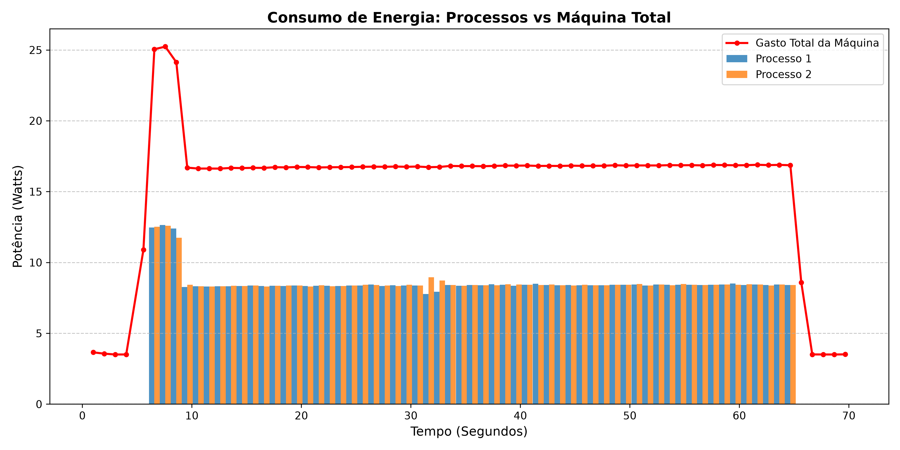
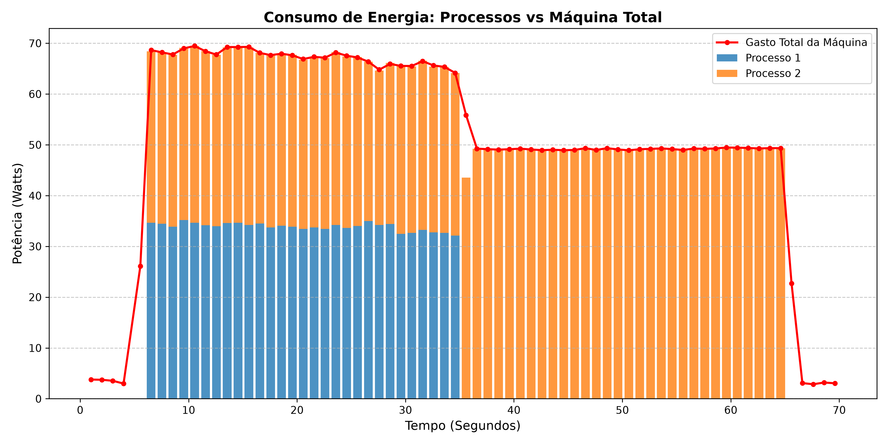

No passo anterior, utilizamos um script para monitorar os contadores de energia do processador via Powercap, os contadores de tempo de CPU globais do sistema e contadores de tempo de CPU específicos de dois processos (+ seus filhos).

Assim, nessa etapa, trataremos os valores dos contadores brutos com o objetivo de calcular, para cada intervalo de medição, a potência média total da máquina e alocar a fatia correspondente dessa potência para cada processo monitorado, com base no tempo de CPU. 

Abaixo, detalharemos a matemática que será utilizada.

# Modelagem de Potência por Tempo de CPU
A modelagem baseada em uso de CPU realiza a divisão do consumo de energia entre processos de forma proporcional ao tempo que cada processo manteve os núcleos ocupado.

## Cálculo da Potência Total do Processador
Primeiramente, precisamos calcular a potência média do processador em um intervalo de tempo. Na etapa de [tratamento de dados da medição de energia total da máquina](02_tratamento_de_dados_1.md), detalhamos mais a fundo esse cálculo.

De forma resumida, temos:
$$P_{total} = \frac{\Delta E}{\Delta t}$$

## Atribuindo a Potência por Processo

Com a potência total, o tempo de CPU global e o tempo de CPU que um processo ocupou de um intervalo, podemos atribuir a potência média de forma proporcional:

$$P_{Processo} = P_{total} \times \frac{\Delta Ticks_{Processo}}{\Delta Ticks_{TotalCPU}}$$

## Exemplos
Suponha que duas medições foram extraídas do arquivo gerado pelo script de perfilamento (`teste-concorrente`). Seguindo a estrutura de colunas, temos: `[energia_uj, ticks_p1, ticks_p2, ticks_total_cpu, timestamp]`.
```
142691023442 0 0 0 352467.702212871
142726054908 321 295 1329572 352469.242651642
```
Através da subtração entre a linha atual e linha anterior, descobrimos as variações do intervalo:
$$\Delta E = 142726054908 - 142691023442 \approx 35,03 \text{ Joules}$$
$$\Delta t = 352469.242651642 - 352467.702212871 \approx 1,54 \text{ segundos}$$

Com isso, obtemos a potência média consumida pelo processador no intervalo:
$$P_{total} = \frac{35,03}{1,54} \approx 22,74 \text{ Watts}$$

Agora, calculamos as variações de tempo de CPU (ticks) para realizar o fatiamento:

$$\Delta Ticks_{P1} = 321 - 0 = 321 \text{ ticks}$$

$$\Delta Ticks_{P2} = 295 - 0 = 295 \text{ ticks}$$

$$\Delta Ticks_{Total CPU} = 1329572 \text{ Ticks ativos total do sistema}$$

Aplicando o modelo de divisão proporcional para o Processo 1 ($P_{P1}$):

$$P_{P1} = 22,74 \text{ W} \times \left( \frac{321}{1329572} \right) \approx 0,0054 \text{ Watts}$$

# Script para Fatiamento da Potência:
Para automatizar essa tarefa o script abaixo recebe o arquivo com os dados brutos e calcula a a fatia de potência dos dois processos entre todas as medições.
```python
outputFile = open(args.nomeOutput, "w")
leitura= []
tempoMediçao = 0

with open(args.caminhoInput, "r") as inputFile:
    linhas = inputFile.readlines()
    linhaAnterior = linhas[0].split()
    
    for i in range(1, len(linhas)):
        linha = linhas[i].split()
        wP1, wP2 = 0, 0

        timestamp = float(linha[4]) - float(linhaAnterior[4])
        tempoMediçao += timestamp
        wTotal = ((float(linha[0]) - float(linhaAnterior[0])) *(10**-6)) /timestamp
        
        if(int(linhaAnterior[3]) != 0 and int(linha[3]) != 0):
            tickTotal = max(0, float(linha[3]) - float(linhaAnterior[3]))
            tickP1 = max(0, float(linha[1]) - float(linhaAnterior[1]))
            tickP2 = max(0, float(linha[2]) - float(linhaAnterior[2]))

            #calcula o consumo em watts de P1 e P2 com uma proporção entre tickP e wTotal
            wP1 = (tickP1 * wTotal)/tickTotal
            wP2 = (tickP2 * wTotal)/tickTotal

        #populando matriz para criar graficos depois
        leitura.append([wP1, wP2, wTotal, tempoMediçao])
        outputFile.write(f"{wP1} {wP2} {wTotal} {tempoMediçao} \n")

        linhaAnterior = linha
```
A lógica é semelhante ao tratamento de dados realizado nas etapas anteriores. Note que o loop da iteração for funciona da seguinte forma:
```
[ Iteração 1 ]
  ↳ Linha 0 (Anterior) ┐
  ↳ Linha 1 (Atual)    ┴→ Fatia a Potência (Watts) entre Processo 1 e Processo 2

[ Iteração 2 ]
  ↳ Linha 1 (Anterior) ┐
  ↳ Linha 2 (Atual)    ┴→ Fatia a Potência (Watts) entre Processo 1 e Processo 2

[ Iteração 3 ] ...
```
Além disso, a condicional `if(int(linhaAnterior[3]) != 0 and int(linha[3]) != 0)` impede a divisão por zero, pois, durante a medição inicial e final em que os processos de estresse ainda não estão inicializados, os valores de tempo de CPU (ticks) estão todos zerados.

Ao fim da execução desse script, geramos uma nova matriz com os valores do fatiamento da potência média de cada intervalo de medição, expostos na seguinte ordem: `[watts_P1, watts_P2, watts_Total, momento_final_intervalo]`.

Além disso os valores também são armazenados, na mesma ordem, em um novo arquivo de texto `teste-concorrente-tratado`. Abaixo, podemos visualizar uma parte de um arquivo de exemplo:
```
0 0 2.6914569082643647 4.001247006002814 
0 0 22.741225850162746 5.541685777017847 
31.141048531233622 29.862680364926817 61.36167198272634 6.542280383000616 
29.81509328942682 31.446004375344184 61.31206363620592 7.544560609036125 
```
# Gerando o Gráfico
Após a execução do trecho de código acima, a matriz leitura passa a armazenar os valores de potência dos processos e do tempo . Com ela, podemos gerar dois gráfico com `matplotlib`. São eles:

1. `grafico_energia_processos1.png`: Gráfico de barras agrupadas lado a lado, utilizado para comparar o consumo dos processos entre si.

2. `grafico_energia_processos2.png`: Gráfico de barras empilhadas, onde o consumo do Processo 2 é desenhado diretamente acima do Processo 1. Útil para compararmos com o consumo total da máquina


# Como Executar?

Ambos o trechos de código acima estão presentes no arquivo `scripts/tratar-dados-medicao-processos.py`. Para executá-lo, será necessário criar um ambiente virtual e instalar as bibliotecas `matplotlib` e `numpy`. Siga os passos a seguir:

1. **Ative o ambiente virtual**:
Na raiz do repositório, digite:
```bash
source venv/bin/activate
``` 
2. **Execute o código:** 
```bash
# Sintaxe: python3 <caminho-do-script> <arquivo_entrada_bruto> <arquivo_saida_tratado>
python3 scripts/tratar-dados-medicao-processos.py ../teste-processos.txt teste-processos-tratado.txt
```
Ao executar, os novos arquivos devem surgir na raiz da pasta do repositório.

Como podemos observar, fatiar o consumo de energia entre os processos é uma tarefa trabalhosa. É nesse contexto que a ferramenta **Scaphandre** se torna nossa aliada. Na próxima etapa, utilizaremos a ferramenta para replicar o experimento e comparar os resultados.

## Navegação
[⬅️ Passo Anterior: Medição de Procesos Concorrentes](03_medicao_processos.md) | [➡️ Passo Seguinte: Medicao de Processos com Scaphandre](05_medicao_scaphandre.md)